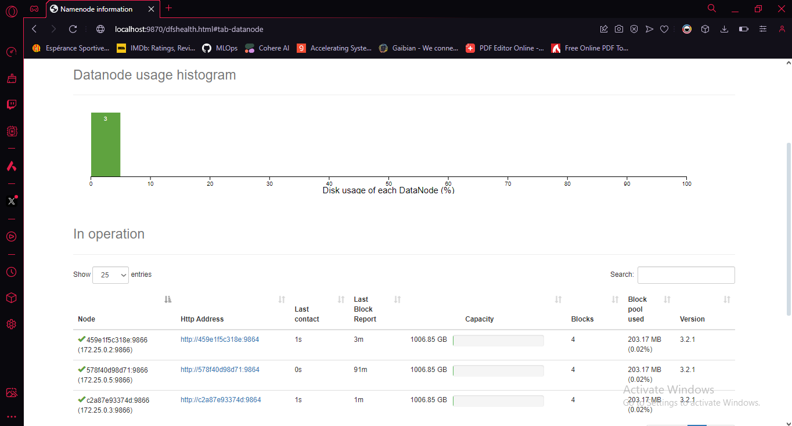
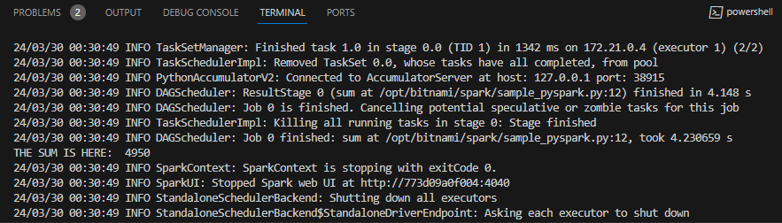
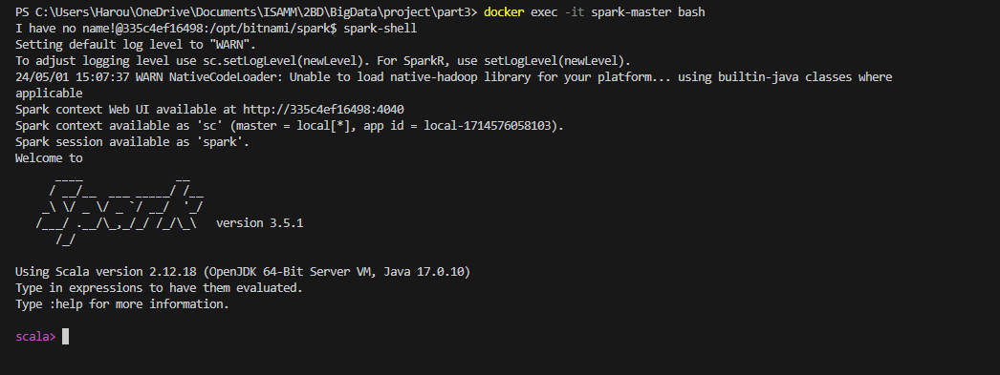

# Big Data using Hadoop Framework
## Part 1 - Installing a Hadoop cluster using Docker
**Before starting make sure that docker and docker-compose are installed in your system**
```bash
docker version
docker-compose version
```
In this part, we will setup a 4-node hadoop cluster (1 master & 3 slaves)
1. Write the following inside 'docker-compose.yml' file :
```
version: "X"

services:
  namenode:
    image: bde2020/hadoop-namenode:2.0.0-hadoop3.2.1-java8
    container_name: namenode
    restart: always
    ports:
      - 9870:9870
      - 9000:9000
    volumes:
      - hadoop_namenode:/hadoop/dfs/name
    environment:
      - CLUSTER_NAME=test
    env_file:
      - ./hadoop.env

  datanode1:
    image: bde2020/hadoop-datanode:2.0.0-hadoop3.2.1-java8
    container_name: datanode1
    restart: always
    volumes:
      - hadoop_datanode1:/hadoop/dfs/data
    environment:
      SERVICE_PRECONDITION: "namenode:9870"
    env_file:
      - ./hadoop.env

  datanode2:
    image: bde2020/hadoop-datanode:2.0.0-hadoop3.2.1-java8
    container_name: datanode2
    restart: always
    volumes:
      - hadoop_datanode2:/hadoop/dfs/data
    environment:
      SERVICE_PRECONDITION: "namenode:9870"
    env_file:
      - ./hadoop.env

  datanode3:
    image: bde2020/hadoop-datanode:2.0.0-hadoop3.2.1-java8
    container_name: datanode3
    restart: always
    volumes:
      - hadoop_datanode3:/hadoop/dfs/data
    environment:
      SERVICE_PRECONDITION: "namenode:9870"
    env_file:
      - ./hadoop.env
  
  resourcemanager:
    image: bde2020/hadoop-resourcemanager:2.0.0-hadoop3.2.1-java8
    container_name: resourcemanager
    restart: always
    environment:
      SERVICE_PRECONDITION: "namenode:9000 namenode:9870 datanode:9864"
    env_file:
      - ./hadoop.env

  nodemanager1:
    image: bde2020/hadoop-nodemanager:2.0.0-hadoop3.2.1-java8
    container_name: nodemanager
    restart: always
    environment:
      SERVICE_PRECONDITION: "namenode:9000 namenode:9870 datanode:9864 resourcemanager:8088"
    env_file:
      - ./hadoop.env
  
  historyserver:
    image: bde2020/hadoop-historyserver:2.0.0-hadoop3.2.1-java8
    container_name: historyserver
    restart: always
    environment:
      SERVICE_PRECONDITION: "namenode:9000 namenode:9870 datanode:9864 resourcemanager:8088"
    volumes:
      - hadoop_historyserver:/hadoop/yarn/timeline
    env_file:
      - ./hadoop.env
  
volumes:
  hadoop_namenode:
  hadoop_datanode1:
  hadoop_datanode2:
  hadoop_datanode3:
  hadoop_historyserver:
```
2. Save and create a file 'hadoop.env' and write inside it :
```
CORE_CONF_fs_defaultFS=hdfs://namenode:9000
CORE_CONF_hadoop_http_staticuser_user=root
CORE_CONF_hadoop_proxyuser_hue_hosts=*
CORE_CONF_hadoop_proxyuser_hue_groups=*
CORE_CONF_io_compression_codecs=org.apache.hadoop.io.compress.SnappyCodec

HDFS_CONF_dfs_webhdfs_enabled=true
HDFS_CONF_dfs_permissions_enabled=false
HDFS_CONF_dfs_namenode_datanode_registration_ip___hostname___check=false

YARN_CONF_yarn_log___aggregation___enable=true
YARN_CONF_yarn_log_server_url=http://historyserver:8188/applicationhistory/logs/
YARN_CONF_yarn_resourcemanager_recovery_enabled=true
YARN_CONF_yarn_resourcemanager_store_class=org.apache.hadoop.yarn.server.resourcemanager.recovery.FileSystemRMStateStore
YARN_CONF_yarn_resourcemanager_scheduler_class=org.apache.hadoop.yarn.server.resourcemanager.scheduler.capacity.CapacityScheduler
YARN_CONF_yarn_scheduler_capacity_root_default_maximum___allocation___mb=8192
YARN_CONF_yarn_scheduler_capacity_root_default_maximum___allocation___vcores=4
YARN_CONF_yarn_resourcemanager_fs_state___store_uri=/rmstate
YARN_CONF_yarn_resourcemanager_system___metrics___publisher_enabled=true
YARN_CONF_yarn_resourcemanager_hostname=resourcemanager
YARN_CONF_yarn_resourcemanager_address=resourcemanager:8032
YARN_CONF_yarn_resourcemanager_scheduler_address=resourcemanager:8030
YARN_CONF_yarn_resourcemanager_resource__tracker_address=resourcemanager:8031
YARN_CONF_yarn_timeline___service_enabled=true
YARN_CONF_yarn_timeline___service_generic___application___history_enabled=true
YARN_CONF_yarn_timeline___service_hostname=historyserver
YARN_CONF_mapreduce_map_output_compress=true
YARN_CONF_mapred_map_output_compress_codec=org.apache.hadoop.io.compress.SnappyCodec
YARN_CONF_yarn_nodemanager_resource_memory___mb=16384
YARN_CONF_yarn_nodemanager_resource_cpu___vcores=8
YARN_CONF_yarn_nodemanager_disk___health___checker_max___disk___utilization___per___disk___percentage=98.5
YARN_CONF_yarn_nodemanager_remote___app___log___dir=/app-logs
YARN_CONF_yarn_nodemanager_aux___services=mapreduce_shuffle

MAPRED_CONF_mapreduce_framework_name=yarn
MAPRED_CONF_mapred_child_java_opts=-Xmx4096m
MAPRED_CONF_mapreduce_map_memory_mb=4096
MAPRED_CONF_mapreduce_reduce_memory_mb=8192
MAPRED_CONF_mapreduce_map_java_opts=-Xmx3072m
MAPRED_CONF_mapreduce_reduce_java_opts=-Xmx6144m
MAPRED_CONF_yarn_app_mapreduce_am_env=HADOOP_MAPRED_HOME=/opt/hadoop-3.2.1/
MAPRED_CONF_mapreduce_map_env=HADOOP_MAPRED_HOME=/opt/hadoop-3.2.1/
MAPRED_CONF_mapreduce_reduce_env=HADOOP_MAPRED_HOME=/opt/hadoop-3.2.1/
```
3. Change directory where the docker-compose file exists and you can now start your container:
```bash
docker-compose up -d
```
4. Browse your http://localhost:9870 and check your cluster .

5. Finally :
```bash
docker-compose down
```
to stop your cluster .

**If you want to create your own Hadoop image you can create a file called Dockerfile and specify how you create your own hadoop image**
```
FROM ubuntu:{ubuntu_version}


WORKDIR /root

RUN apt-get update && apt-get install -y openssh-server openjdk-7-jdk wget

RUN wget https://github.com/kiwenlau/compile-hadoop/releases/download/2.7.2/hadoop-2.7.2.tar.gz && \
    tar -xzvf hadoop-2.7.2.tar.gz && \
    mv hadoop-2.7.2 /usr/local/hadoop && \
    rm hadoop-2.7.2.tar.gz

ENV JAVA_HOME=/usr/lib/jvm/java-7-openjdk-amd64 
ENV HADOOP_HOME=/usr/local/hadoop 
ENV PATH=$PATH:/usr/local/hadoop/bin:/usr/local/hadoop/sbin 

RUN ssh-keygen -t rsa -f ~/.ssh/id_rsa -P '' && \
    cat ~/.ssh/id_rsa.pub >> ~/.ssh/authorized_keys

RUN mkdir -p ~/hdfs/namenode && \ 
    mkdir -p ~/hdfs/datanode && \
    mkdir $HADOOP_HOME/logs

COPY config/* /tmp/

RUN mv /tmp/ssh_config ~/.ssh/config && \
    mv /tmp/hadoop-env.sh /usr/local/hadoop/etc/hadoop/hadoop-env.sh && \
    mv /tmp/hdfs-site.xml $HADOOP_HOME/etc/hadoop/hdfs-site.xml && \ 
    mv /tmp/core-site.xml $HADOOP_HOME/etc/hadoop/core-site.xml && \
    mv /tmp/mapred-site.xml $HADOOP_HOME/etc/hadoop/mapred-site.xml && \
    mv /tmp/yarn-site.xml $HADOOP_HOME/etc/hadoop/yarn-site.xml && \
    mv /tmp/slaves $HADOOP_HOME/etc/hadoop/slaves && \
    mv /tmp/start-hadoop.sh ~/start-hadoop.sh && \
    mv /tmp/run-wordcount.sh ~/run-wordcount.sh

RUN chmod +x ~/start-hadoop.sh && \
    chmod +x ~/run-wordcount.sh && \
    chmod +x $HADOOP_HOME/sbin/start-dfs.sh && \
    chmod +x $HADOOP_HOME/sbin/start-yarn.sh 

RUN /usr/local/hadoop/bin/hdfs namenode -format

CMD [ "sh", "-c", "service ssh start; bash"]
```
**and use this image in your 'docker-compose.yml' instead of the predefined one file**

We can test the MapReduce too .
We have a data file named "purchases.txt" and two python files : "mapper.py" and "reducer.py" .

Just perform these steps and you're done :

**1.**
```bash
docker cp purchases.txt namenode:purchases.txt
docker cp mapper.py namenode:mapper.py
docker cp reducer.py namenode:reducer.py
```
To copy the files from local to the namenode container.

**2.**
```bash
docker exec -it namenode sh
```
To start a new shell session inside "namenode" container .

**3.**
```bash
hadoop fs -mkdir /input


hadoop fs -put purchases.txt /input

hadoop fs -put mapper.py /
hadoop fs -put reducer.py /
```
To copy the data file and the MapReduce python files into HDFS(Hadoop Distributed File System)

**4.**
```bash
hadoop jar $HADOOP_HOME/share/hadoop/tools/lib/hadoop-streaming-3.2.1.jar -
file ./mapper.py -mapper mapper.py -file ./reducer.py -reducer reducer.py -input /input/purchases.txt -output /out
```
To start the MapReduce job .

## Part 2 - Apache Spark using Docker : PySpark
**We will setup a 3-node spark cluster**
1. In a seperate directory , create another 'docker-compose.yml' file :
```
version: '1.0'

services:
  spark-master:
    image: bitnami/spark:latest
    container_name: spark-master
    command: bin/spark-class org.apache.spark.deploy.master.Master
    ports:
    - 9090:8080
    - 7077:7077 
  spark-worker-1:
    image: bitnami/spark:latest
    container_name: spark-worker1
    command: bin/spark-class org.apache.spark.deploy.worker.Worker spark://spark-master:7077
    depends_on:
      - spark-master
    environment:
      SPARK_MODE: worker
      SPARK_WORKER_CORES: 2
      SPARK_WORKER_MEMORY: 2g
      SPARK_MASTER_URL: spark://spark-master:7077
  spark-worker-2:
    image: bitnami/spark:latest
    container_name: spark-worker2
    command: bin/spark-class org.apache.spark.deploy.worker.Worker spark://spark-master:7077
    depends_on:
      - spark-master
    environment:
      SPARK_MODE: worker
      SPARK_WORKER_CORES: 2
      SPARK_WORKER_MEMORY: 2g
      SPARK_MASTER_URL: spark://spark-master:7077
```
2. Run the following command to check the cluster is healthy:
```bash
docker-compose up -d
```
and
```bash
docker logs spark-master
```
and note the URL of the master (it will be used later).

3. Create a python program under name 'sample_pyspark.py' :
```
# Import the necessary modules
from pyspark.sql import SparkSession
from pyspark.sql.functions import *

# Create a SparkSession
spark = SparkSession.builder \
   .appName("My App") \
   .getOrCreate()

rdd = spark.sparkContext.parallelize(range(1, 100))

print("THE SUM IS HERE: ", rdd.sum())
# Stop the SparkSession
spark.stop()
```

4. Type this command to copy the python script containinng pyspark code :
```bash
docker cp sample_pyspark.py spark-master:/opt/bitnami/spark/sample_pyspark.py
```
5. Then type this command the submit the job :
```bash
docker-compose exec spark-master spark-submit --master spark://{MASTER_URL}:7077 sample_pyspark.py
```
and you will get an output that looks like this

6. Now you are done and have a working sample example you can run this to stop your cluster :
```bash
docker-compose down
```

## Part 3 - Choose a dataset and perform a real-world example :
**We will be using the same docker-compose file in Part2.**

So first of all, we will check spark again , it is simple :
1. Run the famous command to start your cluster :
```bash
docker-compose up -d
```

2. 
```bash
docker exec -it spark-master bash
```

3. 
```bash
spark-shell
```

And you will get an output like this :


Now , we have to choose a dataset and perform some analysis using pySpark .

**Dataset link :** [Spotify Charts](https://www.kaggle.com/datasets/sunnykakar/spotify-charts-all-audio-data/data)

**Size :** about 28GB (3GB compressed)

**Columns :** 29

**-->** It is a pretty good dataset to perform some Big Data Analytics .

4. Now, we will modify our docker-compose.yml file to get spark use HDFS as an external storage for our data :
```
version: '1.0'

services:
  spark-master:
    image: bitnami/spark:latest
    container_name: spark-master
    command: bin/spark-class org.apache.spark.deploy.master.Master
    ports:
    - 9090:8080
    - 7077:7077 
    environment:
      SPARK_MASTER_URL: spark://spark-master:7077
      HADOOP_CONF_DIR: /opt/bitnami/hadoop/conf
  spark-worker-1:
    image: bitnami/spark:latest
    container_name: spark-worker1
    command: bin/spark-class org.apache.spark.deploy.worker.Worker spark://spark-master:7077
    depends_on:
      - spark-master
    environment:
      SPARK_MODE: worker
      SPARK_WORKER_CORES: 2
      SPARK_WORKER_MEMORY: 2g
      SPARK_MASTER_URL: spark://spark-master:7077
  spark-worker-2:
    image: bitnami/spark:latest
    container_name: spark-worker2
    command: bin/spark-class org.apache.spark.deploy.worker.Worker spark://spark-master:7077
    depends_on:
      - spark-master
    environment:
      SPARK_MODE: worker
      SPARK_WORKER_CORES: 2
      SPARK_WORKER_MEMORY: 2g
      SPARK_MASTER_URL: spark://spark-master:7077
  hdfs-namenode:
    image: bde2020/hadoop-namenode:2.0.0-hadoop3.2.1-java8
    container_name: hdfs-namenode
    ports:
      - 9000:9000 
      - 8080:8080 
    env_file:
      ./hadoop.env
    volumes:
      - hdfs-data:/hadoop/namenode  
    environment:
      - CLUSTER_NAME=mycluster
  hdfs-datanode-1:
    image: bde2020/hadoop-datanode:2.0.0-hadoop3.2.1-java8
    container_name: hdfs-datanode-1
    depends_on:
      - hdfs-namenode  
    volumes:
      - hdfs-data:/hadoop/datanode  
    environment:
      DFS_DATANODE_NAME_SERVICE_HOST: hdfs-namenode 
      DFS_DATANODE_DATA_DIR: /hadoop/datanode 
      DFS_NAMENODE_RPC_ADDRESS: hdfs-namenode:8020 

volumes:
  hdfs-data: {}
```
